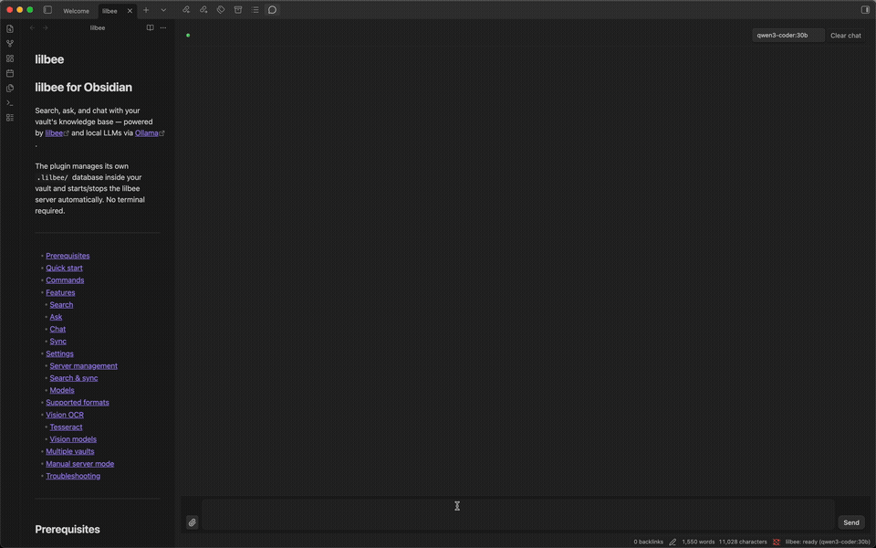

# lilbee for Obsidian

Search, ask, and chat with your vault's knowledge base — powered by [lilbee](https://github.com/tobocop2/lilbee) and local LLMs via [Ollama](https://ollama.com).

## Demo

<details>
<summary><b>Scanned PDF → vision OCR → chat</b> (click to expand)</summary>

Attaching a scanned 1998 Star Wars: X-Wing Collector's Edition manual (PDF with no extractable text), indexing it with vision OCR via [LightOnOCR-2](https://ollama.com/maternion/LightOnOCR-2), and chatting about the dev team credits — entirely local.

> **Note:** Recording sped up 5.5x. Real time was ~4 minutes on an M1 Pro with 32 GB RAM. Most of that is vision OCR extracting each page of the scanned PDF.


</details>

---

- [Prerequisites](#prerequisites)
- [Quick start](#quick-start)
- [Commands](#commands)
- [Features](#features)
  - [Search](#search)
  - [Ask](#ask)
  - [Chat](#chat)
  - [Sync](#sync)
- [Settings](#settings)
  - [Connection](#connection)
  - [Models](#models)
  - [Search & sync](#search--sync)
- [Supported formats](#supported-formats)
- [Troubleshooting](#troubleshooting)

---

## Prerequisites

1. **[Ollama](https://ollama.com)** — local LLM runtime. The embedding model (`nomic-embed-text`) is auto-pulled on first sync.

2. **[lilbee](https://github.com/tobocop2/lilbee)** — the knowledge base engine.

   ```bash
   pip install lilbee        # or: uv tool install lilbee
   ```

> **First-time download:** Ollama models are large files downloaded once. For example, `qwen3:8b` is ~5 GB and `nomic-embed-text` is ~274 MB. After the initial download, models are cached locally and load in seconds. Check what's installed with `ollama list`.

## Quick start

1. Install and start **[Ollama](https://ollama.com)** (`ollama serve`)
2. Start the lilbee server in your vault directory:
   ```bash
   cd /path/to/your/vault
   lilbee init
   lilbee serve
   ```
3. Install the plugin (copy `main.js`, `manifest.json`, and `styles.css` into `.obsidian/plugins/lilbee/`)
4. Enable "lilbee" in Obsidian's community plugins settings
5. Run **"lilbee: Sync vault"** from the command palette (`Ctrl/Cmd + P`) to index your vault
6. Run **"lilbee: Search knowledge base"** and start typing

## Commands

Open the command palette (`Ctrl/Cmd + P`) and type "lilbee" to see all commands:

| Command | Description |
|---------|-------------|
| **lilbee: Search knowledge base** | Open the search modal with live results as you type |
| **lilbee: Ask a question** | Ask a natural language question — returns an answer with source citations |
| **lilbee: Open chat** | Open a chat sidebar with conversation history and streaming responses |
| **lilbee: Sync vault** | Sync vault documents to the knowledge base (add new, update changed, remove deleted) |
| **lilbee: Add current file** | Add the currently open file to the knowledge base |
| **lilbee: Add current folder** | Add all files in the current file's folder to the knowledge base |
| **lilbee: Show status** | Show how many documents and chunks are indexed |

All commands can be bound to hotkeys in Obsidian's Hotkeys settings.

## Features

### Search

The search modal provides **instant semantic search** across your indexed vault. Start typing and results appear in real time (300ms debounce). Results are grouped by document with relevance-ranked excerpts showing page numbers and line ranges where applicable.

Click a source filename to open it in Obsidian.

### Ask

Ask a question and get a single answer synthesized from your vault's content, with source citations. The LLM reads the most relevant chunks and generates a grounded response.

### Chat

The chat sidebar provides a **multi-turn conversation** with your knowledge base:

- Streaming token-by-token responses with markdown rendering
- Full conversation history within the session
- Source citations in expandable details under each response
- **Paperclip button** to add files from your vault or filesystem
- **Connection indicator dot** showing server status (green = connected, red = disconnected)
- **Inline progress banner** for sync/indexing operations
- Model selector dropdown with curated catalog and all installed models
- Clear chat button to start fresh
- Send with Enter, Shift+Enter for newlines

### Sync

Sync indexes your vault documents into the `.lilbee/` vector database:

- **Hash-based change detection** — only re-indexes files that changed
- **Progress tracking** — status bar shows current file and progress (`indexing 3/12 — notes.md`)
- **Summary notice** — shows counts of added, updated, removed, and failed files
- **Auto-sync mode** — optionally watch for file changes and sync automatically (see [Settings](#settings))

## Settings

Open Settings → Community plugins → lilbee to configure the plugin.

### Connection

| Setting | Default | Description |
|---------|---------|-------------|
| **Server URL** | `http://127.0.0.1:7433` | Address of the lilbee HTTP server. |
| **Ollama URL** | `http://127.0.0.1:11434` | Address of the Ollama server. Change this if Ollama runs on a different host or port. |

Both settings have a **Test** button that checks connectivity.

### Models

The Models section lets you manage chat and vision models:

- **Active model dropdown** — shows curated catalog models first (with "(not installed)" suffix for models not yet pulled), then a separator, then any other installed Ollama models. Selecting an uninstalled catalog model auto-pulls it with progress in the chat banner.
- **Model catalog table** — browse available models with size and description, plus a Pull button for each.
- **Refresh** — reload the model list from the server.

Chat models are used for Ask and Chat. Vision models are used for OCR on scanned PDFs and images — enable one by selecting it from the Vision Model dropdown.

### Search & sync

| Setting | Default | Description |
|---------|---------|-------------|
| **Results count** | 5 | Number of search results to return (1–20). |
| **Sync mode** | Manual | `Manual` — sync only via the command palette. `Auto` — watch for file create/modify/delete/rename and sync automatically after a debounce delay. |
| **Sync debounce** | 5000 | Delay in milliseconds before auto-sync triggers after a file change. Only shown when sync mode is "Auto". |

## Supported formats

lilbee indexes a wide range of document and code formats. Text extraction is powered by [Kreuzberg](https://github.com/Goldziher/kreuzberg), code chunking by [tree-sitter](https://tree-sitter.github.io/tree-sitter/).

| Format | Extensions | Notes |
|--------|-----------|-------|
| PDF | `.pdf` | Extracts embedded text; falls back to OCR for scanned pages |
| Office | `.docx`, `.xlsx`, `.pptx` | |
| eBook | `.epub` | |
| Images | `.png`, `.jpg`, `.jpeg`, `.tiff`, `.bmp`, `.webp` | Requires vision model for OCR |
| Data | `.csv`, `.tsv` | |
| Structured | `.xml`, `.json`, `.jsonl`, `.yaml`, `.yml` | Embedding-friendly preprocessing |
| Text | `.md`, `.txt`, `.html`, `.rst` | |
| Code | `.py`, `.js`, `.ts`, `.go`, `.rs`, `.java`, [150+ more](https://github.com/Goldziher/tree-sitter-language-pack) | AST-aware chunking via tree-sitter |

See the [lilbee usage guide](https://github.com/tobocop2/lilbee/blob/main/docs/usage.md#adding-documents) for full details on format handling.

## Troubleshooting

| Problem | Solution |
|---------|----------|
| Connection dot is red | The lilbee server is not running or unreachable. Start it with `lilbee serve` in your vault directory. |
| Search returns no results | Run "lilbee: Sync vault" first to index your documents. |
| Sync fails | Ensure Ollama is running — sync needs the embedding model. Check the developer console (`Ctrl/Cmd + Shift + I`) for error details. |

For issues with the plugin, [open an issue](https://github.com/tobocop2/lilbee/issues). For issues with lilbee itself, see the [lilbee repository](https://github.com/tobocop2/lilbee).

## License

MIT
