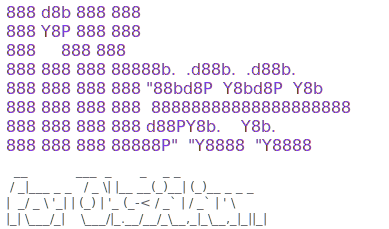

<p align="center">
  <a href="https://obsidian.lilbee.sh/">
    <picture>
      <source media="(prefers-color-scheme: dark)" srcset="docs/obsidian-lilbee-logo-dark.svg">
      
    </picture>
  </a>
</p>

<p align="center"><strong>Local AI search, chat, and web crawling for your vault, inside Obsidian.</strong></p>

<p align="center"><a href="https://obsidian.lilbee.sh/">Project site</a> &nbsp;·&nbsp; <a href="https://obsidian.lilbee.sh/tutorial">Tutorial reel</a> &nbsp;·&nbsp; <a href="https://github.com/tobocop2/obsidian-lilbee/releases">Releases</a> &nbsp;·&nbsp; <a href="https://lilbee.sh/">lilbee engine</a></p>

This plugin runs **[lilbee](https://lilbee.sh/)** against your vault and gives you chat, a web crawler that saves sites into your vault, an auto-generated wiki, click-to-source citations, and a model catalog, all inside Obsidian. It downloads and manages the lilbee server and the AI models for you, with nothing to install separately and no Ollama required, or works with your own Ollama, LM Studio, or cloud models. Everything runs on your computer; cloud models are opt-in, per role.

<p align="center">
  <a href="https://github.com/tobocop2/obsidian-lilbee/actions/workflows/ci.yml"></a>
  <a href="https://obsidian.lilbee.sh/coverage/"></a>
  <a href="https://www.typescriptlang.org/"></a>
  <a href="https://opensource.org/licenses/MIT"></a>
  
  <a href="https://community.obsidian.md/plugins/lilbee"></a>
  <a href="https://github.com/tobocop2/obsidian-lilbee/releases"></a>
</p>

Ask a question in plain English and lilbee answers from your vault, with citations that click straight back to the source line.

<p align="center"></p>

> **Tutorial reel:** every recording on this page (and a few extras) as videos with longer notes at [**obsidian.lilbee.sh/tutorial**](https://obsidian.lilbee.sh/tutorial).

> ## Now in the Obsidian community plugin store
>
> lilbee is an official [community plugin](https://community.obsidian.md/plugins/lilbee): install it from **Settings → Community plugins** inside Obsidian, nothing else needed. Feedback, bug reports, and issues are very welcome.

<p align="center"></p>

> **Heads up: this downloads to your computer.** lilbee is a local search engine with its own models, so the plugin fetches the lilbee server (a few hundred MB) on first launch and the models you pick from the catalog (a few hundred MB up to several GB each) when you choose them. It's all stored locally and runs on your machine.

---

- [Highlights](#highlights)
- [Tutorial reel](https://obsidian.lilbee.sh/tutorial) (long-form videos)
- [Why a local search engine for Obsidian](#why-a-local-search-engine-for-obsidian)
- [What you can do with it](#what-you-can-do-with-it)
- [Quick start](#quick-start)
- [Open the chat](#open-the-chat)
- [How it works](#how-it-works)
- [Privacy & network use](#privacy--network-use)
- [Updating the plugin](#updating-the-plugin)
- [Updating the server](#updating-the-server)
- [Documentation](#documentation)

---

## Highlights

- **Ask your vault in plain English.** Type a question; get an answer with citations that click straight back to the source line.
- **Verify in one click.** Every citation opens a Source Preview scrolled to the exact spot: surrounding paragraphs visible, cited lines highlighted.
- **Save websites into your vault.** Crawl a single page or a whole docs site; the pages land in your vault as markdown notes you can search, chat with, and cite offline, even after the site changes or goes down.
- **Reads more than markdown.** PDFs, Office files, ebooks, CSV / TSV / JSON / YAML, 150+ programming languages, plus OCR for scans and photographed pages.
- **Your models, your machine.** Browse a built-in model catalog straight from Hugging Face Hub, pull one with a click, run it locally. No account needed.
- **Spreads models across your GPUs.** Chat, embedding, reranking, and vision run as a fleet; lilbee places them automatically, splits a model too big for one card across several, and a GPU placement view lets you assign roles to cards by hand on a multi-GPU box.
- **Already on Ollama or LM Studio? Keep them.** lilbee manages models for you by default, but it also works with both, so you never have to switch model managers. Their models appear in the same pickers, alongside lilbee's own.
- **Runs on your computer.** Server, models, index, and vault all stay local; cloud models are opt-in per role, with a persistent indicator when one is active.
- **Remembers what you tell it.** Turn on memory and lilbee holds onto durable facts about you and how you like your answers, then recalls the relevant ones in later chats no matter which conversation they came from. Off by default, managed from a Memories view, and never mixed into your citations.
- **An auto-generated wiki** *(experimental)*: linked markdown pages written from what you've indexed, citation-checked before publish, landing in your vault's graph alongside your own notes.

## Why a local search engine for Obsidian

A vault is already a curated set of documents: notes you've taken, PDFs you've collected, scans you've filed away. That's exactly what a local search engine wants. This plugin points lilbee at your vault so a local model can reason over your library with retrieval-augmented generation (RAG) and answer with citations you click straight back to the source.

An [Encarta 99](https://en.wikipedia.org/wiki/Encarta) you build for yourself, from your own vault, shaped to your needs.

<p align="center"></p>

## What you can do with it

### A library of your vault

Point lilbee at your vault and it builds a searchable library from every note, PDF, ebook, and code file. The pattern works for any vault you've curated, a medical-textbook collection, a field's research papers, a company wiki: whatever it holds becomes searchable, and you can talk to it.

Add a single file from the right-click menu or the command palette, or run **Sync vault** to index everything at once. Background jobs (sync, crawl, wiki build, model downloads) run in a **Task Center**, so you can keep asking questions while they work.

<p align="center"></p>

### Offline copies of websites, inside your vault

> **Watch it:** [crawl the web into your vault](https://obsidian.lilbee.sh/tutorial/#crawl) — fetch a Wikipedia page, then ask a cited question against the saved copy.

Crawl a docs site, a wiki, or a vendor's API reference and the pages land in your vault as ordinary markdown notes. Grab a single page or a whole site; whole-site crawls follow internal links, with depth and page caps when you want them. From then on you search or chat with that copy offline, with citations that click back to the saved page, even after the site changes or goes down.

<p align="center"></p>

### Verify every answer at the source

Every citation in a chat reply or wiki page is a live link. Click it and a Source Preview opens, scrolled to the exact spot, surrounding paragraphs visible and cited lines highlighted; from there, open the full document or copy a deep link back. A confident answer with a footnote is only as good as the footnote, so the check is one click instead of a separate chore. This works for crawled web pages too: citations link back to the saved copy in your vault.

### Ask for several things at once

Put more than one question in a single prompt and lilbee answers each from wherever it lives in your library, with a separate citation per fact.

<p align="center"></p>

### Pick and tune your models

Chat, embedding, vision, and reranking are separate roles, each with its own model. The Model Catalog (command palette or chat toolbar) browses featured picks or searches Hugging Face Hub, shows each model's size and memory before you pull, and flags ones that won't run on your hardware. Defaults are sensible out of the gate; Settings exposes the retrieval and generation knobs when you want to go deeper, each with a reset.

<p align="center"></p>

Each role sits on the chat rail, so you can see what's active and switch it mid-conversation. Hover a pill to see what that role does.

<p align="center"></p>

### Reranking, before and after

Reranking is an optional role that re-scores retrieved passages with a cross-encoder before the model answers. When the note that holds the answer is worded around the cause rather than your keywords, plain vector search can rank it too low to make the cut; reranking pulls it back into context. Here's the same question with reranking off, then on; the answer flips from wrong to right.

<p align="center"></p>

### Place models across your GPUs

lilbee runs its models as a fleet: chat, embedding, reranking, and vision each run in their own process, and lilbee decides where they go. On a single GPU or a Mac's unified memory there's nothing to decide, so it just runs everything together. With two or more GPUs it packs the roles across your cards automatically and splits a model that's too big for one card across several.

The **GPU placement** view (command palette: Open GPU placement) shows where every role runs and how much memory each card has free. On a single device it's a clean read-out of your hardware and what's loaded on it; worker counts for that case live in Settings under Hardware / fleet. On a multi-GPU box you can take over: switch to manual, toggle which cards each role runs on, set how many embedding or vision workers run in parallel, preview the fit, then apply. lilbee rebuilds the fleet on the spot and flags any role that won't fit before you commit.

Applying placement over HTTP is enabled automatically for the plugin's managed server. If you point the plugin at a server you run yourself, set `LILBEE_ALLOW_HTTP_PLACEMENT=true` on it to edit placement from here; otherwise the view stays a read-only read-out.

### Already running Ollama or LM Studio? Keep them.

**lilbee has its own model manager and multi-GPU fleet, built on llama.cpp.** Downloading, running, and updating models for you is the default and the simplest path, with no second app to think about. Battle-tested managers are supported too, so you don't have to switch model managers to use lilbee.

If your models already live in Ollama or LM Studio, point lilbee at the running server and they show up right in the same Chat / Embed / Vision / Rerank pickers, next to lilbee's own models and any cloud models, each labeled by where it runs. You keep managing them in the app you already use; lilbee just uses them. Pick whichever fits how you already work, and mix all three freely.

Pick one of your Ollama models for embedding and another for chat from the catalog's Hosted tab, and the whole pipeline runs on Ollama:

<p align="center"></p>

The same flow works with LM Studio's local server:

<p align="center"></p>

### Documents, code, and scanned images

Your vault is full of more than markdown. lilbee handles the rest:

- **Prose and structured files** (PDFs, Word / Excel / PowerPoint, ebooks, CSV / JSON / YAML) are split so each chunk keeps its section context.
- **Code** (150+ languages) is split along real functions and classes, not arbitrary line ranges.
- **Scanned PDFs and photographed pages** are read with OCR, including a local vision model that keeps tables and layout intact. (A per-vault toggle in Settings.)

<p align="center"></p>

### Cloud models, when you want them

By default everything stays on your machine: server, models, index, vault. For a role where a cloud model genuinely helps (vision OCR, long-context summarization), Settings → Advanced lets you key in an API endpoint for that role only while the rest stay local. A persistent indicator shows whenever a cloud model is the active backend, so it's clear when chunks are leaving the machine.

With your own key, hosted frontier models appear under the catalog's Hosted tab too. Pick a free-tier Gemini model for chat, keep embedding local, and the answer comes from Gemini while still citing your own documents:

<p align="center"></p>

## Experimental

<details>
<summary><strong>Auto-generated wiki</strong> — linked markdown pages written from what you've indexed</summary>

The plugin reads everything you've indexed and writes a wiki about it. Pages compound across sources instead of one-per-document, so concepts and entities that recur get their own page with citations from every source that mentions them. They live in a configurable vault folder (default `lilbee/`) as ordinary markdown with `[[wiki links]]`, so Obsidian's graph view picks them up. Every section is citation-verified and scored for embedding faithfulness before publish; low-confidence pages land in a drafts queue with a review modal (accept, reject, or edit inline), and a lint command surfaces stale or broken citations by page.

</details>

## Quick start

1. In Obsidian, open **Settings → Community plugins → Browse**, search for **"lilbee"**, then **Install** and **Enable**. (Or start from the [store listing](https://community.obsidian.md/plugins/lilbee).)
2. The Setup Wizard auto-launches. Pick a chat model and an embedding model from the featured grid, then run the initial sync.

The plugin downloads and manages the [lilbee](https://lilbee.sh/) server automatically; nothing to install separately. The first launch fetches the right version for your platform and verifies it before starting. Wait for the status bar to show `lilbee: ready`, then open the chat. (The first-run reel near the top walks the whole flow; longer cut on the [tutorial page](https://obsidian.lilbee.sh/tutorial).)

> **Hardware note:** the server runs on your CPU or GPU. A Mac with Apple Silicon (M1+) or a PC with an NVIDIA / AMD / Intel Arc GPU gives the best performance. 8 GB of RAM is the minimum; 16 to 32 GB is recommended. See [lilbee's hardware requirements](https://github.com/tobocop2/lilbee#hardware-requirements) for the full table.

### Open the chat

Once the status bar shows **lilbee: ready**:

| Platform | How to open chat |
|----------|-----------------|
| **macOS** | `Cmd + P` → type **lilbee: Open chat** → Enter |
| **Windows / Linux** | `Ctrl + P` → type **lilbee: Open chat** → Enter |

The chat panel opens in the sidebar. From there you can ask questions, attach individual files, or run **Sync vault** (`Cmd/Ctrl + P` → "lilbee: Sync vault") to index everything at once. Every lilbee surface, the model catalog, the Task Center, chat, is reachable from the command palette.

### Search vs Chat

A toggle at the top of the chat panel picks how each reply is answered:

- **Search** (the default) answers *from your vault*. It retrieves the most relevant passages and replies with citations you can click straight back to the source. Use it when you want grounded answers about your own notes, PDFs, and crawled pages.
- **Chat** turns retrieval off and talks to the model directly, like a plain assistant. No vault lookup and no citations, just the model's own knowledge. Use it for a quick general question or to keep riffing without pulling your notes into the answer.

It's the same model either way; the toggle only decides whether your library is searched first.

### Showing the model's thinking (optional)

Reasoning models work through a problem before they answer. **Show thinking** is an optional toggle in **Settings** (next to the chat mode setting): turn it on to see that thinking in a collapsible block above each reply, or leave it off to just get the answer. It's off by default, and it has no effect on models that don't produce a separate reasoning step.

## How it works

The plugin runs [lilbee](https://lilbee.sh/) in the background: on first launch it downloads the right version for your platform, starts it, and shuts it down when you close Obsidian. Your vault is what it searches; lilbee handles indexing, retrieval, generation, and the wiki, and the plugin is the interface on top.

Vaults on the same computer share one lilbee install and one model cache, so downloaded models are reused instead of fetched again, while each vault keeps its own isolated index.

**One vault at a time.** lilbee follows whichever vault you have open, re-targeting automatically when you switch, and each vault's index is saved and restored when you reopen it. (Advanced users can point the plugin at their own lilbee server from Settings → Connection.)

> **macOS users:** the server binary is unsigned (Apple charges [$99/year](https://developer.apple.com/support/enrollment/) for signing). The plugin clears the quarantine flag automatically. If macOS still blocks it, go to System Settings → Privacy & Security and click **Allow Anyway**. See the [lilbee source](https://github.com/tobocop2/lilbee) if you want to audit the build.

## Updating the plugin

Obsidian handles plugin updates: **Settings → Community plugins → Check for updates**, then update lilbee like any other plugin.

## Updating the server

The plugin tracks the installed lilbee server version. Go to Settings → lilbee → **Check for updates**. If a newer release is available the button changes to **Update to vX.Y.Z**: one click stops the running server, downloads the new version, verifies it, and restarts.

This updates only the lilbee **server**, never the plugin itself. The plugin's own code is updated through Obsidian like any other community plugin; the **Check for updates** button only manages the separate server it downloads. Each server download is checked against the SHA256 digest GitHub publishes for the release before it runs, so a corrupted or tampered download is discarded instead of executed.

## Advanced

Most people never need this. By default the plugin downloads and runs the server for you and stores everything under your OS data directory.

**Run your own server (external mode).** Instead of letting the plugin manage it, you can run the lilbee server yourself and point the plugin at its URL in Settings. How you keep it running depends on your setup: a systemd unit, a launchd / `brew services` agent, or whatever daemonization tool you prefer. See [running lilbee as a service](https://github.com/tobocop2/lilbee#running-as-a-service-optional) in the lilbee docs for the per-platform recipes.

**Move where lilbee stores its data.** Set `LILBEE_DATA` in your shell before launching Obsidian:

```bash
export LILBEE_DATA="/path/to/lilbee-data"      # macOS / Linux
# Windows (PowerShell):
#   $env:LILBEE_DATA = "D:\lilbee-data"
```

## Privacy & network use

Everything runs on your machine by default, and the plugin tells you when that changes. For transparency, here's exactly what it does and what leaves your computer:

- **Managed or external server.** The plugin talks to a local lilbee server over `127.0.0.1`. In **managed mode** (the default) Obsidian runs the server for you so you can get going without installing or managing the executable yourself. It **prompts before downloading** the server, then starts it when Obsidian launches and stops it when you close Obsidian. In **external mode** you run the lilbee server yourself, keeping it alive however suits your setup ([as a service or daemon](https://github.com/tobocop2/lilbee#running-as-a-service-optional)), and point the plugin at it; in that mode the plugin downloads no executable.
- **What it contacts, and why.** [GitHub](https://github.com): in managed mode, to download the lilbee server and check for updates. [Hugging Face Hub](https://huggingface.co): the model catalog you browse and pull models from. Nothing else, unless you opt into a cloud model below.
- **Cloud models are opt-in, per role.** By default chat, embedding, vision, and reranking all run locally. You can point a single role at your own API endpoint (Settings → Advanced); only that role's requests leave your machine, and a persistent indicator shows whenever a cloud model is active.
- **No account, no telemetry.** lilbee needs no account to run locally, and the plugin collects no analytics or usage data of any kind. Cloud models use an API key you enter yourself.
- **Vault access.** The plugin reads your vault to index it and, if you enable the wiki, writes generated pages into a vault folder you choose (default `lilbee/`). The server install and model cache live in Obsidian's app data folder, outside your vault.

Running a local server is unusual for an Obsidian plugin, so the automated store review flags a few capabilities. Here is exactly what each one does:

- **Shell execution.** In managed mode the plugin starts and stops the lilbee server executable it downloaded (and verified against GitHub's published SHA256). It runs nothing else, and external mode never spawns a process.
- **Filesystem access outside the vault API.** The server install, model cache, and index live in Obsidian's app data folder, so the plugin uses Node's `fs` to download, verify, and clean up those files. The only other paths it touches are ones you pick yourself in a save/open dialog when exporting or importing a dataset.
- **Environment variables.** Read only to locate the server's data folder (`HOME`/`USERPROFILE`, `XDG_DATA_HOME`, `LOCALAPPDATA`, and the `LILBEE_DATA` override). The plugin never reads your hostname or username, and nothing from your environment leaves your machine.
- **Vault file listing.** The plugin lists your vault's files to know what to index and to keep the index in sync as you edit. File contents go only to the local server.

## Documentation

See **[Usage Guide](docs/usage.md)** for the full reference: every command, every setting, the chat toolbar, supported formats, troubleshooting, and advanced configuration. For the underlying engine (what it indexes, how retrieval works, model formats, hardware requirements), see [lilbee](https://lilbee.sh/).

## Support

Something broken? See [TROUBLESHOOTING.md](TROUBLESHOOTING.md), and use **Settings → lilbee → Export diagnostics** to attach logs to a bug report.

lilbee is built and maintained by one person. If it is useful to you, you can chip in via [PayPal](https://paypal.me/lilbeedotsh). Bug reports and pull requests help just as much.

## License

MIT
